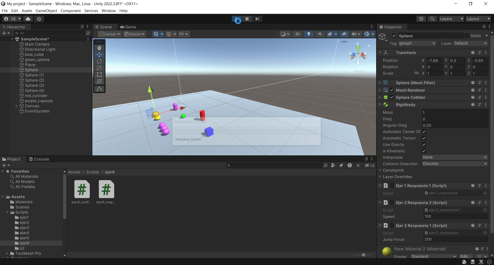

# Interfaces Inteligentes
## Práctica 4. Delegados y Eventos

1. A partir de la escena que has estado utilizando en las últimas prácticas, crea la siguiente mecánica. Cuando el cubo colisiona con el cilindro, las esferas de tipo 1 cambian su color y las esferas de tipo 2 se desplazan hacia el cilindro.

Script Listener: [Listener.cs](scripts/ejer1/ejer1_notificador.cs)
Scripts Sender: [Sender.cs](scripts/ejer1/ejer1_respuesta.cs) y [Sender2.cs](scripts/ejer1/ejer1_respuesta1.cs)

---

2. Cuando el cubo colisiona con cualquier objeto que no sean esferas del grupo 1, las esferas en el grupo 1 se acercan al cilindro. Cuando el cubo toca cualquier esfera del grupo 1, las esferas del grupo 2 aumentan de tamaño.

Script Listener: [Listener.cs](scripts/ejer2/ejer2_notificador.cs)
Scripts Sender: [Sender.cs](scripts/ejer2/ejer2_respuesta.cs) y [Sender2.cs](scripts/ejer2/ejer2_respuesta1.cs)

---

3. Cuando el cubo se aproxima al cilindro, las esferas del grupo 1 cambian su color y saltan y las esferas del grupo 2 se orientan hacia un objeto ubicado en la escena con ese propósito. 

Script Listener: [Listener.cs](scripts/ejer3/ejer3_notificador.cs)
Scripts Sender: [Sender.cs](scripts/ejer3/ejer3_respuesta.cs) y [Sender2.cs](scripts/ejer3/ejer3_respuesta1.cs)

---

4. Implementar la mecánica de recoger esferas en la escena que actualicen la puntuación del jugador. Las esferas de tipo 1 suman 5 puntos y las esferas de tipo 2 suman 10. Mostrar la puntuación en la consola.

Script Listener: [Listener.cs](scripts/ejer4/ejer4_notificador.cs)
Script Sender: [Sender.cs](scripts/ejer4/ejer4_respuesta.cs)

---

5. Partiendo del script anterior crea una interfaz que muestre la puntuación que va obteniendo el cubo. 

Script Listener: [Listener.cs](scripts/ejer5/ejer5_notificador.cs)
Script Sender: [Sender.cs](scripts/ejer5/ejer5_respuesta.cs)

---

6. Genera una escena que incluya elementos que se ajusten a la escena del prototipo y alguna de las mecánicas anteriores.

---